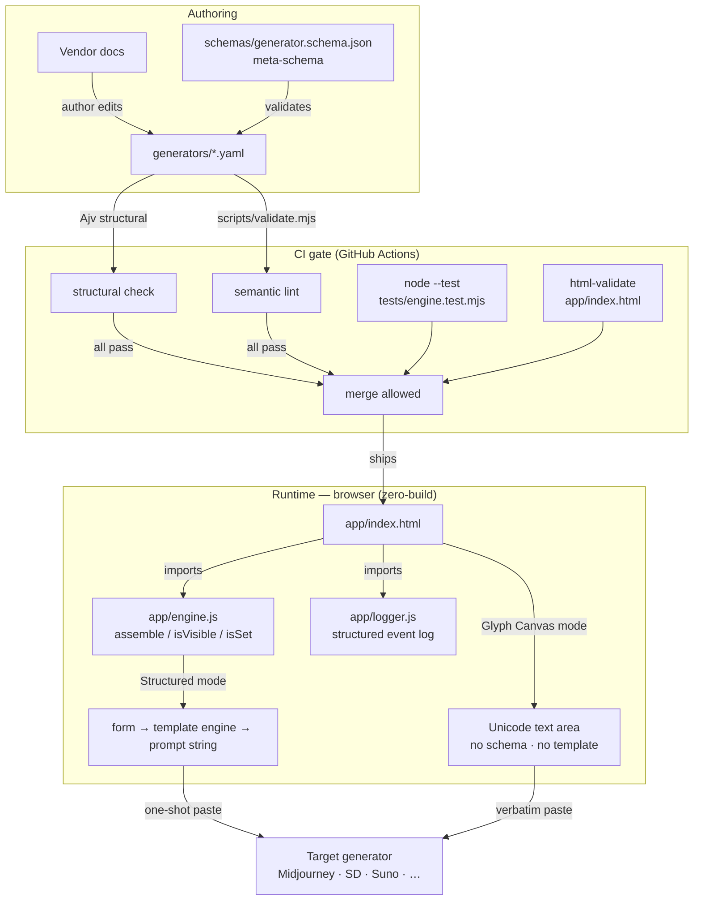

# Prompt Architect

[](https://github.com/0thernes/prompt-architect/actions/workflows/ci.yml)
[](https://github.com/0thernes/prompt-architect/actions/workflows/codeql.yml)
[](LICENSE)
[](docs/ROADMAP.md)
[](tests/engine.test.mjs)

**A schema-driven, non-AI universal prompt builder** with two first-class
creative modes — and a standalone prompt-assembly engine usable anywhere JavaScript
runs. One app that aggregates the options and settings of every major AI
generator — image, video, 3D, music/audio, worlds — so a power user fills out a
form and copies a perfect one-shot prompt for the chosen target. And for the
entropy artist: a freeform Glyph Canvas for composing 140,000+ Unicode glyphs,
coloured text, and symbols as deliberate incoherence — pushing models into liminal
latent space where uncanny outputs live.

No app-hopping. No context exhaustion. No model calls.

> **Status: PoC → MVP** — engine module extracted and tested (37 passing unit
> tests), computed-token flag-rename support landed, `node:test` CI gate added,
> AUDIT-500 deep inspection at 425/500, full ERD/complexity documentation written.
> Local only; not yet published.

---

## The problem

The generative landscape has fragmented into dozens of tools, each with its own
flag syntax, parameter names, value ranges, and defaults: Midjourney's
`--stylize 0–1000`, Stable Diffusion's CFG scale and sampler zoo, Runway, Suno,
Luma, world-builders — every one a separate mental model. Power users burn time
and attention:

- **App-hopping** — keeping a dozen documentation pages open just to remember
  which flag exists in which tool, at which version.
- **Context exhaustion** — asking a chat LLM to "write me a Midjourney prompt"
  spends tokens, hallucinates flags that don't exist, and goes stale the moment
  the vendor ships an update.
- **Trial-and-error cost** — every malformed prompt on a paid generator is real
  money and queue time wasted.

---

## The solution — two creative modes

Prompt Architect is deliberately **not** an AI product. It is a deterministic
form-to-prompt compiler — and an entropy canvas.

### Structured mode (schema-driven)

1. Every supported generator is described by a **plugin** — a pure data file
   (YAML) validated against a published meta-schema.
2. The app reads the plugin and **renders a form**: sliders with the real
   ranges, dropdowns with the real enums, conditional fields that appear only
   when relevant.
3. A **template engine assembles the native prompt string** for that exact
   target — correct flags, canonical parameter order, length limits enforced —
   ready to paste in one shot.

A **complexity tier** (Simple / Advanced / Everything) keeps the form usable at
every skill level: beginners see 3–5 essential controls; power users who opt into
`Everything` get the full parameter surface. This acknowledges an honest UX
tension: most users benefit from fewer choices, so the full control surface is
opt-in.

**The schema is the product.** Generators change weekly; code that hard-wires
their options rots immediately. Here, vendor drift is absorbed by editing a YAML
file — no code change, no release, no rebuild. The meta-schema
([`schemas/generator.schema.json`](schemas/generator.schema.json)) is the stable
contract; everything above and below it is replaceable.

### Glyph Canvas mode (entropy mode)

A freeform composition surface with no schema, no fields, no template engine. The
input medium is the full Unicode range — 140,000+ glyphs, symbols, emoji —
composed with colour tagging and font-weight markers. The goal: deliberate
incoherence that places the model in uncanny / liminal latent space, producing
outputs that no structured prompt can reach. The human acts as curator and
tastemaker, selecting from the uncanny output stream.

This mode is grounded in 0thernes's documented avant-garde practice — entropy and
chaos as the medium. The Glyph Canvas is backed by a seven-technique taxonomy
(T1-T7) derived from direct analysis of the published corpus:

| Code | Technique |
|------|-----------|
| T1 | AI-only cryptography frame |
| T2 | Negative-constraint stacking |
| T3 | Anti-instruction paradox |
| T4 | Keyword avalanche |
| T5 | Self-referential identity invocation |
| T6 | Contradiction bomb |
| T7 | The inverse dual (maximum-order pole) |

These map directly to planned UI affordances: negative-constraint stack builder,
keyword-avalanche palette, contradiction toggle, and inverse-dual flip. Full
description: [`docs/CREATIVE-MODES.md`](docs/CREATIVE-MODES.md). Annotated
corpus: [`corpus/0thernes-entropy-corpus.md`](corpus/0thernes-entropy-corpus.md).

---

## Plugin-as-data architecture

The central design invariant is that **plugins are inert data, never code**.

A plugin is one YAML document validated against `schemas/generator.schema.json`.
It carries:

- **Identity** — `id` (stable permanent key), `name`, `modality`, `version`,
  `targetVersion`, `docsUrl`, `lastVerified`.
- **Fields** — typed form controls (`string`, `number`, `boolean`, `enum`,
  `multi`) with ranges, options, `dependsOn` visibility conditions,
  `omitIfDefault` gating, and `tier` hints for the complexity system.
- **`promptTemplate`** — the assembly recipe in mustache-style `{{token}}` /
  `{{#token}}…{{/token}}` syntax.
- **`outputRules`** — `parameterOrder` (single source of truth for flag order),
  `separator`, `collapseWhitespace`, `trim`, `maxLength`,
  `overflowStrategy`.
- **`computedTokens`** — declarative flag-rename rules (e.g. Midjourney's
  `--niji` vs `--v` mutual exclusion) expressed as `{{=id}}` tokens without
  any code.

Because plugins carry no rendering logic, the same plugin file can drive a web
form, a CLI wizard, or any future renderer. Because they are inert data, a
community plugin registry (v1 scope) can accept third-party contributions without
ever executing third-party code — the CI gate alone decides.

---

## The engine — `app/engine.js`

The prompt-assembly logic lives in a standalone ES module that runs identically
in the browser and in Node.js (zero dependencies). The public API:

```js
import { assemble, isVisible, isSet, formatValue } from './app/engine.js';

const { text, charCount, overLimit } = assemble(plugin, values);
```

The engine implements in a single linear pass:

- Token substitution (`{{key}}`) and conditional section blocks
  (`{{#key}}…{{/key}}`).
- `omitIfDefault` gating — `--chaos 0` never clutters a Midjourney prompt.
- `dependsOn` field visibility (hidden fields are treated as unset).
- `computedTokens` (`{{=id}}` scalar and `{{#=id}}…{{/=id}}` conditional
  sections) for declarative flag-rename rules.
- Canonical flag ordering via `outputRules.parameterOrder`.
- `collapseWhitespace` / `trim` post-processing.
- `maxLength` + `overflowStrategy` (`warn` / `truncate` / `error`).

Full complexity analysis: [`docs/COMPLEXITY.md`](docs/COMPLEXITY.md).
Full data-model diagram: [`docs/ERD.md`](docs/ERD.md).

---

## Architecture diagram



---

## Quickstart

### Open the app

```
app/index.html   ← open directly in any modern browser, no server needed
```

Pick a generator, fill the form, press **Copy**. The assembled prompt is
ready to paste into the target generator.

### Author a plugin

1. Create `generators/my-generator.yaml` following the structure of
   `generators/midjourney.yaml`.
2. Validate locally before opening a PR:

```bash
npm install --no-save ajv@8 ajv-formats@3 js-yaml@4
node scripts/validate.mjs
```

3. Run the unit tests:

```bash
node --test tests/engine.test.mjs
```

4. Run html-validate:

```bash
npx html-validate@8 app/index.html
```

All three must exit 0. The CI gate runs the same checks on every push and pull
request.

---

## Repository layout

```
schemas/
  generator.schema.json      meta-schema — the stable public contract (JSON Schema 2020-12)

generators/
  midjourney.yaml            reference plugin — flag-style syntax, MJ v5.2–v7
  stable-diffusion.yaml      reference plugin — A1111 line-oriented paste format

app/
  index.html                 zero-build PoC — open from disk, no bundler
  engine.js                  ESM prompt-assembly engine (browser + Node)
  logger.js                  structured event log (see docs/OBSERVABILITY.md)

tests/
  engine.test.mjs            37 unit tests — node:test + node:assert, zero deps

scripts/
  validate.mjs               structural (Ajv) + semantic plugin validator

corpus/
  0thernes-entropy-corpus.md five CC-licensed entropy prompts + T1-T7 annotations

docs/
  ARCHITECTURE.md            design rationale, meta/plugin/engine layering, trust model
  MODALITIES.md              all-modality coverage map, art-school taxonomy, complexity tiers
  CREATIVE-MODES.md          structured vs Glyph Canvas; entropy practice; T1-T7 tooling spec
  ERD.md                     entity-relationship diagram, ERM invariants, ERP sequence/state
  COMPLEXITY.md              Big-O time and space for every operation; worked 50-field example
  AUDIT-500.md               500-point / 25-section deep inspection — 425/500 (2026-06-12)
  AUDIT.md                   condensed self-audit checklist
  TESTING.md                 test strategy, pyramid, coverage targets, how to run
  OBSERVABILITY.md           structured log schema, event catalogue, app/logger.js
  SECURITY-NOTES.md          defensive security posture — assets, trust model, mitigations
  ROADMAP.md                 PoC → MVP → v1 phases with acceptance criteria
  KANBAN.md                  project board — WIP limits, all cards, current column state
  FAQ.md                     common questions answered honestly
  adr/
    0001-zero-build.md       ADR: zero-build discipline
    0002-plugins-as-data.md  ADR: plugins as inert data
```

---

## Status and roadmap

| Phase | Focus | Key deliverables | State |
|-------|-------|-----------------|-------|
| **PoC** (v0.1.x) | Prove the schema drives a real form and correct prompts | Meta-schema, 2 reference plugins, zero-build app, CI gate, engine module (37 tests), computed tokens, AUDIT-500, ERD, Complexity docs | **Done** |
| **MVP** (v0.2 – v0.5) | Daily-drivable tool for the founder; full modality coverage | Plugin loader, 8–10 curated plugins, presets, history, PWA, complexity-tier toggle, Glyph Canvas baseline (Unicode palette, named saves) | **Next** |
| **v1** (community) | Plugin corpus grows without maintainer code changes | Community plugin registry (static JSON + content hashes), plugin signing, export/import, i18n, entropy-technique library UI (T1-T7), corpus import/save, inverse-dual toggle | **Planned** |

Detailed phases with acceptance criteria: [`docs/ROADMAP.md`](docs/ROADMAP.md).
Current work state and backlog: [`docs/KANBAN.md`](docs/KANBAN.md).

---

## Documentation index

| Document | What it covers |
|----------|----------------|
| [`docs/MODALITIES.md`](docs/MODALITIES.md) | All-modality coverage map (image, video, 3D, audio, worlds), tool lists, art-school taxonomy, complexity tiers |
| [`docs/CREATIVE-MODES.md`](docs/CREATIVE-MODES.md) | Structured vs Glyph-Canvas mode; 0thernes's entropy practice; T1-T7 technique taxonomy; Unicode/colour tooling spec |
| [`corpus/0thernes-entropy-corpus.md`](corpus/0thernes-entropy-corpus.md) | Five CC-licensed entropy prompts with T1-T7 technique annotations (primary source material) |
| [`docs/ARCHITECTURE.md`](docs/ARCHITECTURE.md) | Meta-schema / plugin / engine layering, plugin-as-data rationale, template engine semantics, validation flow, trust boundary |
| [`docs/ERD.md`](docs/ERD.md) | ERD/ERM/ERP — Mermaid entity-relationship diagram, invariants, runtime sequence and state diagrams |
| [`docs/COMPLEXITY.md`](docs/COMPLEXITY.md) | Big-O time and space complexity for every operation; worked 50-field "Everything"-tier example |
| [`docs/AUDIT-500.md`](docs/AUDIT-500.md) | 500-point / 25-section deep inspection — per-section scores, Top 10 findings (425/500, 2026-06-12) |
| [`docs/AUDIT.md`](docs/AUDIT.md) | Condensed self-audit checklist (correctness, security, plugin trust, accessibility) |
| [`docs/TESTING.md`](docs/TESTING.md) | Test strategy, pyramid, coverage targets, how to run |
| [`docs/OBSERVABILITY.md`](docs/OBSERVABILITY.md) | Structured log schema, event catalogue, `app/logger.js` |
| [`docs/SECURITY-NOTES.md`](docs/SECURITY-NOTES.md) | Defensive security posture — assets, trust model, mitigations |
| [`docs/ROADMAP.md`](docs/ROADMAP.md) | PoC → MVP → v1 phases with explicit acceptance criteria |
| [`docs/KANBAN.md`](docs/KANBAN.md) | Project board — WIP limits, all task cards, current column state |
| [`docs/FAQ.md`](docs/FAQ.md) | Common questions answered honestly |

---

## Quality gates

Every push and pull request runs:

1. `node --test tests/engine.test.mjs` — 37 unit tests (zero deps)
2. `node scripts/validate.mjs` — structural (Ajv) + semantic lint of all plugins
3. `npx html-validate@8 app/index.html` — HTML well-formedness
4. CodeQL — static security analysis

Evidence from 2026-06-12 HEAD: 37 tests pass, 2 plugins OK, html-validate exit 0,
AUDIT-500 score 425/500.

---

## Tech stack

- **Spec:** JSON Schema draft 2020-12 (meta-schema), YAML plugins
- **App:** single-file HTML + vanilla ES2022, no framework, no bundler, no
  runtime dependencies — matches the owner's no-build PWA house style
- **Engine:** `app/engine.js` — standalone ES module, browser + Node compatible,
  zero runtime dependencies
- **Quality gate:** GitHub Actions — Ajv structural validation, semantic lint
  (`scripts/validate.mjs`), `node --test`, `html-validate`, CodeQL

---

## License

MIT — see [LICENSE](LICENSE). © 2026 0thernes.

The five entropy prompts in [`corpus/0thernes-entropy-corpus.md`](corpus/0thernes-entropy-corpus.md)
are published under Creative Commons by 0thernes (first featured in a Medium
article by Carolina Delgado, October 2025). They are reproduced here under that
licence with full attribution as specified in the corpus file.
