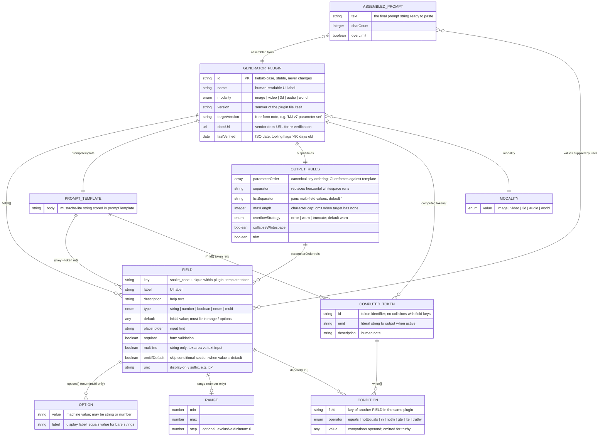
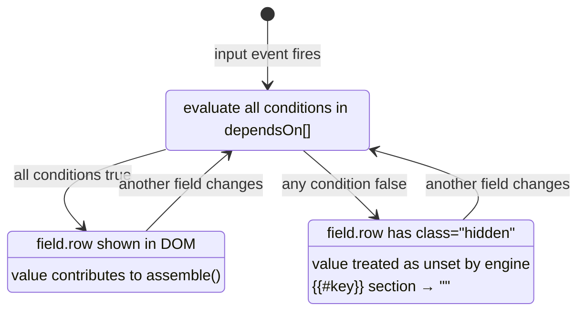
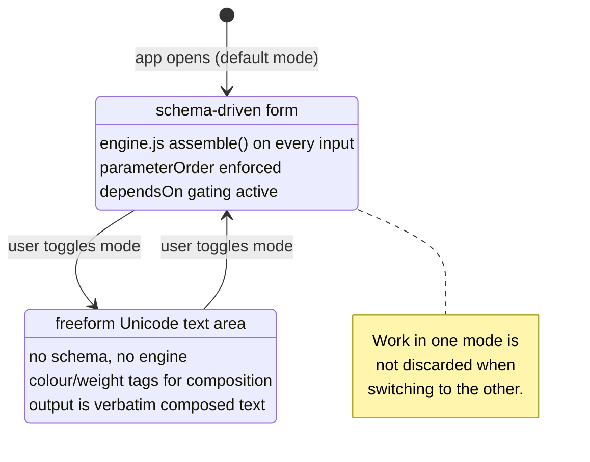

# ERD — Entity-Relationship Model and Process

This document covers three views of the Prompt Architect data model:

- **ERD** — Mermaid `erDiagram` of the plugin/prompt data model as
  specified by `schemas/generator.schema.json`.
- **ERM** — the meta-schema-governs-plugins relationship, field dependency
  graph (the `dependsOn` DAG), modality coverage, and invariants.
- **ERP** — Mermaid `sequenceDiagram` and `stateDiagram` for the runtime
  process: plugin load → form render → value capture → assemble → preview,
  the `dependsOn` visibility state machine, and the structured vs
  Glyph-Canvas branch.

---

## ERD — Data model

Every entity maps directly to a property or `$def` in
`schemas/generator.schema.json`.



### Attribute notes

| Entity | Key design decision |
|--------|---------------------|
| `GENERATOR_PLUGIN.id` | Permanent; never changes after first publish. Presets (planned) and prompt history key off it. |
| `FIELD.type` | Determines which sibling properties are required: `number` → `range` required; `enum`/`multi` → `options` required; others forbidden. JSON Schema `allOf/if/then` enforces this. |
| `FIELD.omitIfDefault` | When true, the engine skips any `{{#key}}…{{/key}}` conditional section if the current value equals `field.default`. Keeps prompts minimal for parameters the generator already assumes (e.g. Midjourney `--chaos 0`). |
| `OPTION` | Either a bare string (value doubles as label) or an explicit `{value, label}` pair. The schema uses `oneOf`. |
| `COMPUTED_TOKEN.id` | Used in `promptTemplate` as `{{=id}}` (scalar) or `{{#=id}}…{{/=id}}` (conditional section). Must not collide with any `FIELD.key` in the same plugin. |
| `OUTPUT_RULES.parameterOrder` | The **single source of truth** for flag ordering. `scripts/validate.mjs` asserts that the first occurrence of each token in `promptTemplate` respects this order; template edits cannot silently reorder generator flags. |
| `ASSEMBLED_PROMPT` | Produced at runtime by `app/engine.js:assemble(plugin, values)`; never stored in the plugin. |

---

## ERM — Relationships, constraints, and invariants

### 1. Meta-schema governs plugins

```
schemas/generator.schema.json
        │
        │ validates (Ajv, CI)
        ▼
generators/*.yaml   (one YAML doc = one GENERATOR_PLUGIN)
```

The meta-schema is the stable public contract. Plugins are pure data; the
app knows nothing generator-specific. This decoupling is intentional: vendor
drift is absorbed by editing a YAML file, with no code change and no release.

**Cardinalities:**

| Relationship | Cardinality | Notes |
|---|---|---|
| Meta-schema : plugins | 1 : N | One schema governs all plugins. |
| Plugin : fields | 1 : 1..N | At least one field required (`minItems: 1`). |
| Plugin : promptTemplate | 1 : 1 | Exactly one template per plugin. |
| Plugin : outputRules | 1 : 1 | Exactly one rule set per plugin. |
| Plugin : computedTokens | 1 : 0..N | Optional; Stable Diffusion has none. |
| Field : options | 1 : 1..N | Required for `enum`/`multi`; forbidden for others. |
| Field : range | 1 : exactly 1 | Required for `number`; forbidden for others. |
| Field : dependsOn conditions | 1 : 0..N | Optional; 0 = always visible. |
| ComputedToken : when conditions | 1 : 0..N | 0 conditions = always active. |

### 2. Field dependency graph — the `dependsOn` DAG

Every `CONDITION` references another `FIELD.key` by name within the same
plugin. This creates a directed acyclic graph (DAG) over fields: an edge
`A → B` means "B is visible only when A satisfies a condition."

```
     subject ─────── (no dependsOn; always visible)
     niji_version ── (no dependsOn; always visible)
     model_version ─► dependsOn: niji_version == "none"
     hires_fix ────── (no dependsOn)
     hires_upscaler ► dependsOn: hires_fix is truthy
```

**Invariants enforced by `scripts/validate.mjs`:**

1. Every `condition.field` must be the `key` of a field declared in the same
   plugin (no dangling references).
2. The graph must be acyclic — a field cannot depend, directly or
   transitively, on itself. (Cycle detection is O(V+E) DFS; enforced in CI.)
3. A hidden field (all `dependsOn` conditions not satisfied) is treated as
   *unset* by the template engine: its conditional section collapses to `""`.

### 3. Template token integrity

Every `{{key}}` or `{{#key}}…{{/key}}` reference in `promptTemplate` must
name a declared `FIELD.key`. Every `{{=id}}` or `{{#=id}}…{{/=id}}` reference
must name a declared `COMPUTED_TOKEN.id`. `scripts/validate.mjs` enforces
both; CI rejects any plugin with orphaned or undeclared token references.

### 4. `parameterOrder` is the canonical flag order

`OUTPUT_RULES.parameterOrder` lists every `FIELD.key` in the required output
order. `scripts/validate.mjs` asserts that the first occurrence of each token
in `promptTemplate` respects this sequence. This is the **single source of
truth** for flag ordering — changing the template cannot silently reorder
flags.

### 5. Modality coverage

The five modality values (`image`, `video`, `3d`, `audio`, `world`) act as a
namespace partition over the plugin corpus. The UI groups and filters plugins
by modality. A `"freeform"` modality value is planned (see schema comment) for
lightweight Glyph Canvas metadata plugins; it is not yet a valid enum value.

| Modality | Plugins (PoC) | Planned (MVP+) |
|----------|--------------|----------------|
| image    | midjourney, stable-diffusion | DALL·E 3, FLUX, Firefly, Ideogram, Krea |
| video    | — | Runway Gen-3/4, Suno Luma, Pika, Kling |
| 3d       | — | Meshy, Tripo3D |
| audio    | — | Suno v4, Udio, Stable Audio |
| world    | — | Skybox AI |

---

## ERP — Runtime process

### Sequence diagram — structured mode

```mermaid
sequenceDiagram
    actor User
    participant UI as app/index.html
    participant Engine as app/engine.js
    participant Plugin as generators/*.yaml

    User->>UI: open app (file:// or server)
    UI->>Plugin: load plugin (embedded JS object in PoC;<br/>fetch + YAML parse in MVP)
    Plugin-->>UI: plugin object {id, fields[], promptTemplate, outputRules, computedTokens[]}

    UI->>UI: buildForm(plugin)<br/>O(fields): one DOM control per field;<br/>defaults applied to state{}

    loop on every input event
        User->>UI: change a field value
        UI->>UI: state[key] = newValue
        UI->>Engine: isVisible(field, state) — for each field
        Engine-->>UI: boolean (show/hide each .row)
        UI->>Engine: assemble(plugin, state)
        Engine->>Engine: buildByKey map — O(fields)
        Engine->>Engine: resolveComputedTokens — O(computedTokens)
        Engine->>Engine: expandTemplate — O(|promptTemplate|)
        Engine->>Engine: post-process (collapse, trim, maxLength) — O(|output|)
        Engine-->>UI: {text, charCount, overLimit}
        UI->>UI: render pre#output; update meta line
    end

    User->>UI: click Copy
    UI->>User: clipboard.writeText(text)
```

### Sequence diagram — Glyph Canvas mode (entropy mode)

```mermaid
sequenceDiagram
    actor User
    participant UI as app/index.html (Glyph Canvas tab)

    User->>UI: switch to Glyph Canvas
    UI->>UI: show Unicode text area;<br/>hide structured form and engine pipeline

    loop composition
        User->>UI: type / paste glyphs, symbols, emoji
        User->>UI: optionally apply colour tags [text|#hex]
        UI->>UI: display coloured composition in canvas
    end

    User->>UI: Copy (raw) — strip colour/weight tags
    UI->>User: clean Unicode text on clipboard
```

The Glyph Canvas does **not** call `engine.js`. No template, no schema, no
field map, no `parameterOrder`. The output is the composed text verbatim.

### State diagram — `dependsOn` visibility machine

Each field with at least one `dependsOn` condition is a small state machine.
The machine is re-evaluated on every input event (O(fields × avg_conditions)).



### State diagram — structured vs Glyph-Canvas branch



---

## Cross-links

- Schema source: [`schemas/generator.schema.json`](../schemas/generator.schema.json)
- Engine source: [`app/engine.js`](../app/engine.js)
- Plugin examples: [`generators/midjourney.yaml`](../generators/midjourney.yaml),
  [`generators/stable-diffusion.yaml`](../generators/stable-diffusion.yaml)
- Modality coverage and field-type taxonomy: [`MODALITIES.md`](MODALITIES.md)
- Creative modes (Structured vs Glyph Canvas): [`CREATIVE-MODES.md`](CREATIVE-MODES.md)
- Architecture and design rationale: [`ARCHITECTURE.md`](ARCHITECTURE.md)
- Big-O complexity analysis: [`COMPLEXITY.md`](COMPLEXITY.md)
